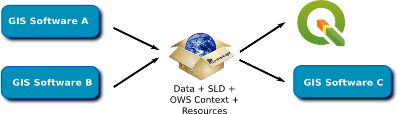

qgpkg
========

Introduction
------------

qgpkg implements a `GeoPackage <http://geopackage.org/>`_ extension to store
QGIS mapping information in a GeoPackage database file.
The OGC geopackage format was designed with the goal of being interoperable across a range of environments, in particular mobile devices operating in offline and near offline scenarios.

This plugin introduces two approaches for storing mapping projects, based on two different geopackage extensions:
the `QGIS extension <https://github.com/pka/qgpkg/blob/master/qgis_geopackage_extension.md>`_ and the `OWS context extension <https://github.com/pka/qgpkg/blob/master/ows_geopackage_extension.md>`_.

The goal of the ``qgis geopackage extension`` is to enable users to share their QGIS projects, including style and resources.
This extension stores a QGIS project file in one of the extension tables, which works for the described use case, but does not allow interoperability with other GIS software.

.. image:: workflow-qgis.png

The ``ows geopackage extension`` was designed with the specific goal of enabling interoperability with other GIS software, being completely based on OGC standards.
The idea is to store styling using OGC:SLD, and the project context using OGC:OWS_Context, so that other software can encode/decode this information.

In both extensions, data, resources and style are packed along with project information (e.g.: layer order or visibility, bounding box), enabling a self-contained, portable mapping project.

QGIS plugin
-----------

The QGIS plugin adds a toolbar button for saving the current
project in a GeoPackage file and another one for loading a QGIS project from a
GeoPackage file.

Support is given for loading multiple layers and styles from the geopackage. In the `examples <./examples>`_ folder you may find examples of
geopackages using the `qgis <./examples/small_world.gpkg>`_ and `ows <./examples/multiple_layers.gpkg>`_ extensions.

Although the user can read from either extension, using a detection mechanism, currently the writing operation is only supported for the ``qgis extension``.
If you are interested in writing geopackages using the ``ows extension``, please have a look at `ArcGIS GeoCat Bridge <https://www.geocat.net/bridge/>`_.

qgpkg library and cli
---------------------

In addition, gpkg is implemented as a Python library with a command line interface.

Commands::

  usage: qgpkg.py [-h] {info,write,read} ...

  Store QGIS map information in GeoPackages

  optional arguments:
    -h, --help         show this help message and exit

  commands:
    valid commands

    {info,write,read}
      info             GeoPackage content information
      write            Save QGIS project in GeoPackage
      read             Read QGIS project from GeoPackage

Please note that the cli supports **only** for the ``qgis extension``.

History
-------

This plugin was initially created by Cédric Christen and Pirmin Kalberer (Sourcepole) using the ``qgis_extension`` approach.
Later it was forked by Joana Simoes and Paul van Genuchten (GeoCat), who added support to the ``ows_extension``.
The fork was merged into the master branch, to create this version: a plugin which enables users to read projects using either geopackage extension.
Support to writing in both extensions, is also envisioned for the near future.

Compatibility
-------------

This plugin requires ``QGIS`` 2.18 and ``GDAL`` 2.0 or newer.

On Ubuntu Linux you can install GDAL 2 from the UbuntuGIS repository and on OS X, you can use the package compiled by `King Chaos <http://www.kyngchaos.com/software/qgis>`_.

Development
-----------

::

    git clone https://github.com/pka/qgpkg.git

Running tests:

::

    apt-get install python-nose

::

    nosetests

For running qgpkg commands from source tree:

::

    alias qgpkg="PYTHONPATH=$(pwd) $(pwd)/qgpkg_cli/qgpkg.py"

Issues
------

You are welcome to report any issues using the `github track <https://github.com/pka/qgpkg/issues>`_.

License
-------

qgpkg is Copyright © 2016-2017 Sourcepole AG. It is free software,
and may be redistributed under the terms specified in the `LICENSE.txt <https://github.com/pka/qgpkg/blob/master/LICENSE.txt>`_ (Library - MIT)
and `LICENSE <https://github.com/pka/qgpkg/blob/master/qgis_plugin/qgpkg/LICENSE>`_ (Plugin - GPL V2) files.
