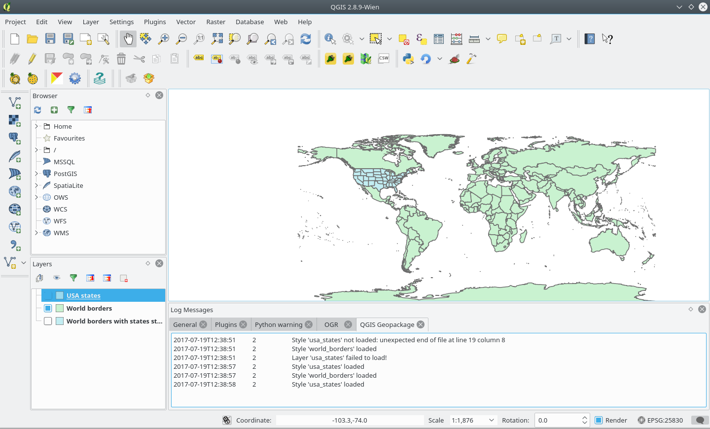

qgpkg
========

Introduction
------------

qgpkg implements a `GeoPackage <http://geopackage.org/>`_ extension to store
QGIS mapping information in a GeoPackage database file.

The specification is separated into `QGIS extensions <https://github.com/pka/qgpkg/blob/master/qgis_geopackage_extension.md>`_ and  `OWS context extensions <https://github.com/pka/qgpkg/blob/master/ows_geopackage_extension.md>`_.

This fork and branch implements the `OWS context extension`. Please refer to the `original forked repository <https://github.com/pka/qgpkg>`_, for more information about the components.

QGIS plugin
-----------

The QGIS plugin adds two buttons to the QGIS GUI. One for saving the current
project in a GeoPackage file (disabled) and one for loading a QGIS project from a
GeoPackage file. The project is read using `this GeoPackage extension <https://github.com/GeoCat/qgpkg/blob/ows-spec/ows_geopackage_extension.md>`_.

Support is given for loading multiple layers and styles from the geopackage.
The example bellow refers to the geopackage multiple_layers.gpkg, on folder `examples <./examples>`_.

Compatibility
-------------
As stated in the metadata file, this plugin requires QGIS 2.1.8 (or more recent versions).
If you compile QGIS, make sure to use `Qt4` and `PyQt4`.

This plugin reads `geopackages` generated by bridge, which uses a recent gdal version.
In order to be able to open those geopackages you *need* to compile QGIS with 'gdal2'.

Unfortunately, in the public repositories, there are no QGIS packages for ubuntu/linux using gdal2. 

Development
-----------

::

    git clone https://github.com/GeoCat/qgpkg

License
-------
This project retains the original MIT license from the forked repository, which has Copyright © 2016 Sourcepole AG.
